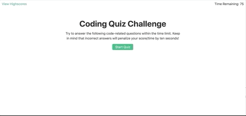

# Code-Quiz

## Introduction

This application allows the user to test their coding knowledge by asking them a series of code-related questions that they must answer correctly in under 75 seconds. Their final score is equal to how much time they have left on the timer once they've answered the last question correctly. The user may then save their score and return to the homepage to try again and beat their best time. If they wish to clear out their high score history and start over they may do so at any time.

Building this quiz taught me so much about creating an application from scratch. It taught me about the importance of pseudocoding and breaking down a project into smaller tasks. This way they can be completed and tested one at a time, making the project as a whole seem more accomplishable. It taught me how to use the DOM to manipulate my HTML file using JavaScript, and in doing so how to build single-page dynamic web applications. This project also taught me about working with timers and how to store information in local storage that can be accessed from your device at a later time.

## Technologies

* JavaScript
* Bootstrap 4
* HTML
* CSS

## How to Use

* Click the Start Quiz button to get started
* Answer the following questions
* Race against the clock to answer questions before time runs out
* If you answer a question incorrectly 10 seconds is deducted from your time and final score
* If you answer all questions before time runs out, your time remaining equals your score
* Save your score and initials to Highscore board
* Press Clear Highscores button if you want to clear the score board
* Press Go Back button to return to the home screen and try the quiz again
* View high scores at any time by clicking the View Highscores link

## Deployed Site

https://jpreston-alt.github.io/Code-Quiz/
